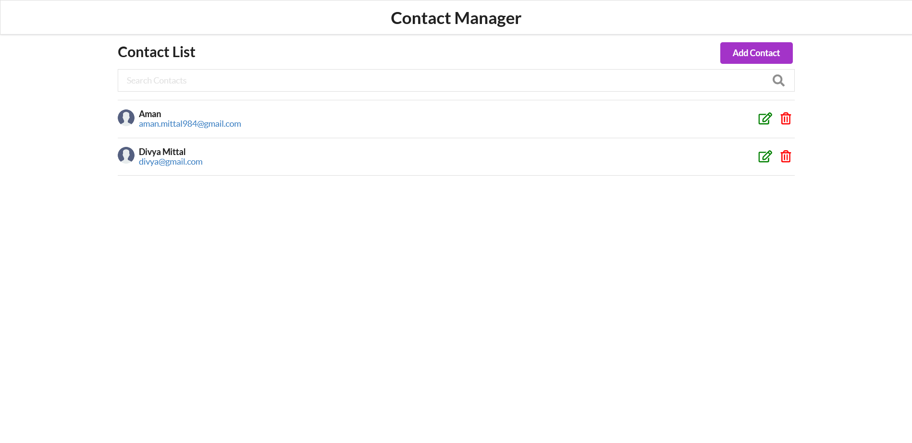
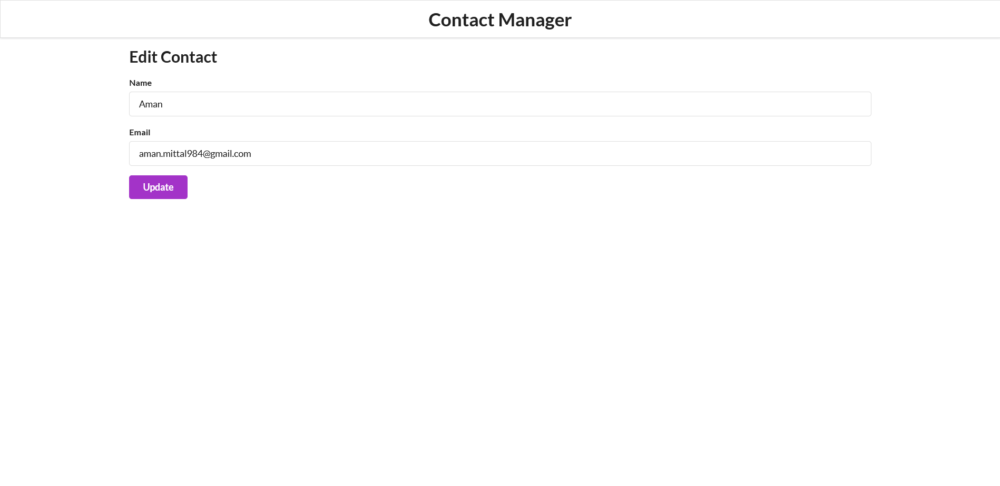

# React Contact App
This is a basic react application with CRUD functionalities. 
The app uses <code> json-server </code> package as a substitute for backend.
 
 

# Here are some screenshots of this app

 
 

 

### Steps to use the app

 
<ol>
    <li>Fork the repo / Download the code as zip.
    <li>Open a terminal and type <code>cd server-api
    <li>npm i 
    <li>npm run startServer</code>
    <li>The server will start on PORT 3006 <a>(http://localhost:3006)</a>
    <li>Now open another terminal for <code> form-app
    <li>npm i
    <li>npm start </code>
    <li>The app will start on PORT 3000 <a>(http://localhost:3000)</a>
    <li>Now you can <code>create, update, delete and search</code> contacts.